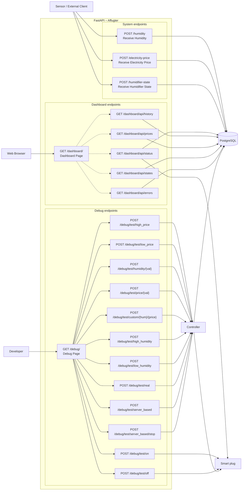

# Mermaid for diagrammer

## API-design

```
flowchart LR
    A[Sensor / RPI] -->|POST /humidity| B[FastAPI server]
    C[Electricity price API] -->|POST /electricity-price| B
    D[Humidifier controller] -->|POST /humidifier-state| B

    B --> E[(PostgreSQL database)]
```

## determine_state procesdiagram

```
flowchart TD
    A[Receive humidity and electricity price] --> B[Read daily electricity price threshold]
    B --> C[Read current Shelly state]

    C --> D{Humidity at or below minimum threshold?}

    D -- Yes --> E[Desired state = OFF<br/>Humidity below minimum]
    D -- No --> F{Humidity at or over emergency threshold?}

    F -- Yes --> G[Desired state = ON<br/>Emergency humidity]
    F -- No --> H{Electricity price at or below threshold?}

    H -- Yes --> I[Desired state = ON<br/>Electricity price acceptable]
    H -- No --> J[Desired state = OFF<br/>Electricity price too high]

    E --> K{Shelly currently OFF<br/>and desired state ON<br/>and OFF timestamp exists?}
    G --> K
    I --> K
    J --> K

    K -- Yes --> L{Restart delay still active?}
    K -- No --> N{Dark time active?}

    L -- Yes --> M[Desired state = OFF<br/>Compressor lockout]
    L -- No --> N
    M --> N

    N -- Yes --> O[Desired state = OFF<br/>Dark time]
    N -- No --> P[Keep desired state]

    O --> Q[Return desired state and reason]
    P --> Q
```

## server_based_loop procesdiagram

``` 
flowchart TD
    A[Read humidity from sensor] --> B{Electricity price logged<br/>for current timestamp?}

    B -- No --> C[Retrieve new electricity prices<br/>from API]
    C --> D[Read electricity price<br/>from database]
    B -- Yes --> D

    D --> E[Determine desired state]

    E --> F{Current Shelly state<br/>matches desired state?}

    F -- No --> G[Change Shelly state]
    F -- Yes --> H[Check compressor lockout]

    G --> H

    H --> I{Lockout necessary?}

    I -- Yes --> J[Enforce compressor lockout]
    I -- No --> K[Wait until next<br/>15-minute increment]

    J --> K
```

## application startup procesdigram

```
flowchart TD
    A[Application starts] --> B[Check Shelly connection]

    B --> C{Connection successful?}
    C -- No --> D[Log Shelly error]
    C -- Yes --> E[Fetch electricity prices]
    D --> E

    E --> F{Fetch successful?}
    F -- No --> G[Log electricity price error]
    F -- Yes --> H[Get daily price threshold]
    G --> H

    H --> I{Threshold retrieved?}
    I -- Yes --> J[Store threshold in application state]
    I -- No --> K[Log threshold error<br/>Set threshold = None]

    J --> L[Start server-based control loop]
    K --> L

    L --> M[Application running]
```

## API

